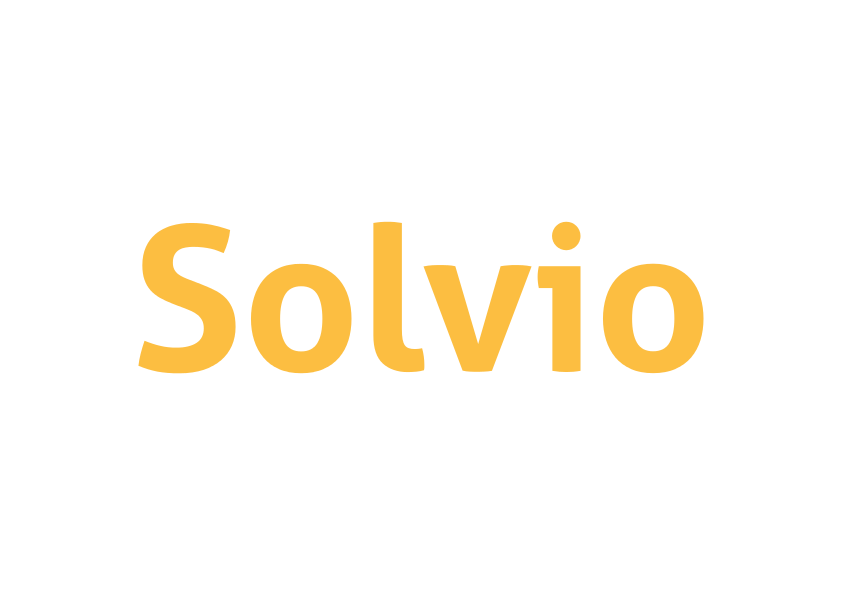
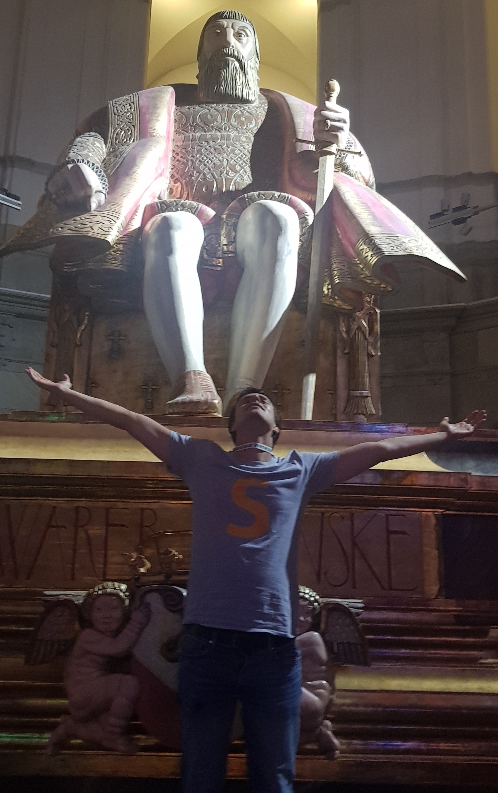

Dom Teiml

Dec 2019

---

In this presentation I'm selling 3 things:
- the team
- the problem
- the solution

---

# Team 👫

---

## Full-time

### Dom

- My background is 25% math, 25% econ and 50% software engineering
- I taught math at universities in Europe & US, including UC Berkeley and Cornell
- I worked in/started pre-seed startups, unicorns and small businesses
- I travelled extensively in Asia, my hobbies are spiritual practices, year-round cycling and sauna.

<figure>
  
  <figcaption>Wikipedia 2019</figcaption>
</figure>

---

## Potentially full-time

| Name   | Superpower            |
| ------ | --------------------- |
| Anh    | Mathematician, Python |
| Dmitry | Front-end engineer    |
| Martin | Business dev          |
| Sam    | Formal methods        |
| Sultan | Full-stack engineer   |

---

# Problem 😕

---

- Current education system is very inflexible. If one applies to Oxford right now, they will begin studying in October 2021. That is *22 months* from now.
- It is *de facto* impossible to get credentials for informal education such as self-learning.
- Finding good materials/resources on the internet is difficult. We still lack an efficient aggregator for education content.
- Education in English is overpriced in Europe, and education *in genera*l is overpriced in US.
  
  and many many others.

---

# Solution 😌

---

- Our goal is to create an end-to-end education system for the 21st century.

- One that would be recognized by governments for purposes of taxes, immigration...
  - We're the first project in history with this aim.

- We also think the best way to bootstrap such a proj is with a B2C app.

- I will now describe the chronology of features (might change subject to user interviews & iteration).

---

## Search engine for learning resources

- We'll start by developing a search engine for learning resources.
- Unlike Google, it will be richly customizable
- Unlike Udemy/Coursera, it will be not be platform-specific.
- It will include:
  - podcasts
  - Youtube playlists
  - documentaries/docuseries
  - MOOCs
  - books

  and many others.

---

## Credentialing platform

- Currently universities bundle content with credentials.
  - Our aim is to modularize content (both offline & online) and centralize credentialing
- We'll build a platform where anyone can submit a work like essay, Github project or other
  - They get matched for a 1-hour recorded video
  - Others can rate how well they demonstrated understanding of multiple topics
- Our goal is to create a cheaper, more flexible, and less cheatable credentialization than the legacy system.

---

## Questionbank

- As surprising as it sounds, there actually don't exist good tools for learning software engineering or the sciences.
- We'll build an offline-first, in-editor tool for learning & demonstrating knowledge of popular languages and libraries
- We'll also build a proof-checker to enable interactive math lessons for all skill-levels.

---

## Offline courses

- Again, there doesn't exist an Uber for offline courses.
- At this stage we can leverage our traction to finally make this happen.
- The first partners will likely be existing courses
  - summer schools
  - language schools
  - math camps
- This will just set the stage to make *all* real-life teaching modular, flexible and accessible through Solvio

---

## Hiring platform

- We can leverage the platform to build a better hiring platform.
- It is very hard to gauge candidates today:
  - Credentials differ around the world
  - Candidates often don't have any work to show
  - You can't filter for skills in a fine-grained manner - e.g. experience with certain frameworks

---

## Monetization

- Due to the ambitions of this project, our main focus is on the execution - making a domain-specific search engine that would give better results than `Google`
- If this plan succeeds, a small capture margin of the value created will be huge absolute wise
- Examples where value can be captured:
  - Small yearly/lifetime fee for personalized searches
  - Commission from sale of offline courses
  - Income-share agreements
  - Commission from hiring

---

## Seed round

We're raising $500k.

---

# Demo

What else can I say for me to be able
 
to show you what we have, so far? 

